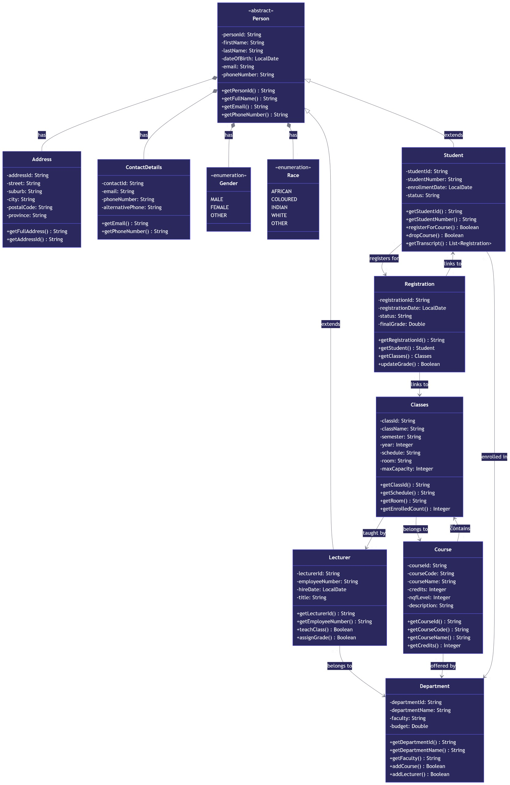

# ADP372S Assignment 1 – Student Registration System

## Overview
This project was developed by our group for ADP372S Assignment 1. The main goal was to build a Student Registration System while applying what we’ve learned about GitHub collaboration, Maven, Domain-Driven Design (DDD), and Test-Driven Development (TDD).

We designed the system to represent a real-world scenario where students register for courses and classes, lecturers teach classes, and departments manage everything behind the scenes.

## UML Class Diagram
Below is the UML diagram that we created to represent our domain model and the relationships between all the entities.

## Domain (Entities)
Based on our UML design, we implemented the domain layer using the **Builder Pattern**.

The main entities we worked with include:
- Student, Lecturer, Course, Department, Classes, Registration  
- Person (abstract class), Address, ContactDetails  
- Gender and Race (Enums)

## Factory
Each entity has its own factory class which we used to handle object creation.  
We followed a **TDD approach**, meaning we wrote tests to verify that our factories create objects correctly.

## Repository
For the repository layer, we created a generic `IRepository` interface with standard CRUD operations:
- create, read, update, delete, and getAll  

Each entity has its own repository and implementation class, and we applied the **Singleton pattern** where needed.

## Testing
We created test classes for both the factory and repository layers using **JUnit**.  
This helped us make sure everything works as expected and also shows our understanding of TDD.

## GitHub Collaboration
We worked as a group using GitHub throughout the project.  
Each member:
- Forked the main repository  
- Created their own branch  
- Worked on their assigned tasks  
- Submitted pull requests  

The group leader reviewed and merged all contributions into the main repository. We made sure to keep our repositories in sync.

## Authors
- DAMIEN NOLAN SWARTS (222868791)  
- CHRISTIAN HAKIZIMANA (219117675)  
- SIPHAMANDLA CHULUMANCO TSHIJILA (231070071)  
